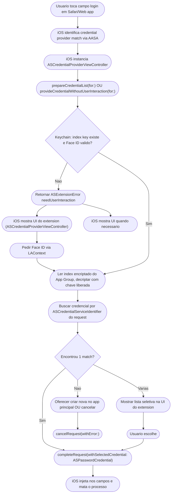

# swift-autofill-extension

## Por que essa skill existe

O Credential Provider Extension expande a superficie de ataque do SafeBox de forma critica:

- Extensao tem processo separado, mas compartilha o App Group com o app host => **vazamento de memoria** entre os dois e comum
- Extensao tem **limite de memoria agressivo** (~30-60 MB dependendo do device) => derivar chave Argon2id dentro dela e impossivel
- Apple revisa extensions com criterio adicional (guideline 5.1.1 + 2.5.1 + 4.0)
- Injecao de credencial sem Face ID adequada = vazamento trivial de senhas para quem pegar o device desbloqueado
- Identidades NAO donadas = usuario nao ve SafeBox na QuickType bar do teclado, chia perdendo competitividade pratica

## Arquitetura obrigatoria

### Componentes

```
Host App (SafeBox)                    AutoFill Extension
────────────────────                  ──────────────────────
- Login completo do usuario           - ASCredentialProviderViewController
- Deriva chave AES                    - Le index encriptado do App Group
- Le vault completo do Supabase       - Pede Face ID para desbloquear index
- Serializa index simplificado        - Itera e encontra credencial por
  (id, uri, username)                   domain match (AASA)
- Encripta index com chave extensao   - Retorna ASPasswordCredential
  (derivada da AES principal)
- Salva no App Group
- Donates ASPasswordCredentialIdentity
```

### App Group compartilhado

- Bundle ID host: `app.safebox.ios`
- Bundle ID extensao: `app.safebox.ios.AutoFill`
- App Group: `group.app.safebox.ios.shared`

Arquivos no App Group (todos com `NSFileProtectionComplete`):

| Arquivo                          | Conteudo                                                  | Acessibility Keychain equivalente |
|----------------------------------|-----------------------------------------------------------|-----------------------------------|
| `autofill-index.enc`             | Array encriptado `[{id, domains[], username, createdAt}]` | N/A (file protection)             |
| `autofill-index.nonce`           | Nonce do AES-GCM do index                                  | N/A                               |
| `autofill-last-sync.json`        | Timestamp ISO da ultima sincronizacao                      | N/A                               |

Chave do index fica **somente no Keychain**, compartilhada via Keychain Access Group (nao em arquivo do App Group).

- Keychain Access Group: `$(AppIdentifierPrefix)app.safebox.ios.shared`
- Item account: `autofill_shared_index_key`
- Accessibility: `kSecAttrAccessibleAfterFirstUnlockThisDeviceOnly` (extensao precisa ler em background do keyboard)
- Access Control: `.biometryCurrentSet` (nunca liberar sem Face ID)

## Lifecycle do extension (diagrama)



## Donate para QuickType bar (critico para UX)

Sem donate, o SafeBox so aparece quando o usuario toca "Passwords" -> "SafeBox" manualmente. Com donate, SafeBox aparece diretamente acima do teclado. **E diferencial competitivo obrigatorio v1.**

### Quando donar

- Login bem sucedido e unlock do vault
- Apos cada sync que muda o vault
- Apos CRUD de credencial (add/update/delete)

### Quando remover

- Logout
- Account deletion
- Rotacao de senha-mestra detectada

### Codigo

```swift
import AuthenticationServices

@MainActor
final class CredentialIdentityDonator {
    static let shared = CredentialIdentityDonator()
    private let store = ASCredentialIdentityStore.shared

    /// Idempotente. Pode ser chamado a cada sync sem efeito colateral visivel.
    func replaceAll(with credentials: [CredentialLite]) async {
        let state = await store.state()
        guard state.isEnabled else {
            // Usuario nao habilitou SafeBox como credential provider nas Settings.
            // Nao e erro; apenas nao donar.
            return
        }

        // Remove tudo antes de inserir o novo set (evita drift em caso de remocao de item)
        do {
            try await store.removeAllCredentialIdentities()
        } catch {
            // Registrar em OSLog com privacy .private; nao travar o fluxo
        }

        let identities: [ASPasswordCredentialIdentity] = credentials.flatMap { cred in
            cred.domains.compactMap { domain in
                guard let serviceId = ASCredentialServiceIdentifier(identifier: domain, type: .domain) as ASCredentialServiceIdentifier? else {
                    return nil
                }
                return ASPasswordCredentialIdentity(
                    serviceIdentifier: serviceId,
                    user: cred.username,
                    recordIdentifier: cred.id
                )
            }
        }

        do {
            try await store.saveCredentialIdentities(identities)
        } catch {
            // Se exceder quota, logar e seguir; iOS caps ~5000 identidades
        }
    }

    func removeAll() async {
        try? await store.removeAllCredentialIdentities()
    }
}

struct CredentialLite: Codable {
    let id: String
    let username: String
    let domains: [String]   // normalizar dominios (sem scheme, sem path)
}
```

### Normalizacao de dominios (atencao)

- Remover `https://`, `http://`
- Remover path, query, fragment
- Lowercase
- **Preservar subdominios exatos** (ASCredentialServiceIdentifier com tipo `.domain` faz match com AASA; ver documentacao Apple)
- NAO converter `www.exemplo.com` em `exemplo.com` automaticamente; pode quebrar match

## Protecao biometrica antes de injetar

Mesmo se `provideCredentialWithoutUserInteraction(for:)` estiver tecnicamente disponivel, o SafeBox **sempre** exige Face ID antes de injetar (sem excecao no v1).

### Porque

- Se o device e desbloqueado mas o app do SafeBox esta locked por inatividade, injetar sem biometria contradiz o modelo de seguranca
- Reviewers da Apple verificam esse detalhe para password managers

### Implementacao

```swift
override func provideCredentialWithoutUserInteraction(for credentialRequest: ASCredentialRequest) {
    // SafeBox politica: SEMPRE requerer UI + biometria.
    // Isso faz iOS chamar prepareInterfaceToProvideCredential(for:) em seguida.
    self.extensionContext.cancelRequest(
        withError: NSError(domain: ASExtensionErrorDomain,
                           code: ASExtensionError.userInteractionRequired.rawValue)
    )
}

override func prepareInterfaceToProvideCredential(for credentialRequest: ASCredentialRequest) {
    // UI minima, pede Face ID, decripta index, encontra match, retorna.
    Task { await self.handleRequest(credentialRequest) }
}

private func handleRequest(_ request: ASCredentialRequest) async {
    do {
        let key = try await keychain.readBiometryProtectedKey(
            account: "autofill_shared_index_key",
            reason: "Desbloquear senhas do SafeBox"
        )
        let index = try await indexStore.loadAndDecrypt(using: key)
        guard let match = index.findBestMatch(for: request) else {
            extensionContext.cancelRequest(withError: noMatchError())
            return
        }
        // IMPORTANTE: buscar a credencial completa via Supabase sync em background
        // OU via cache local encriptado do App Group. Index NAO carrega senha em claro.
        let fullCredential = try await credentialLoader.loadPassword(recordId: match.id, using: key)
        extensionContext.completeRequest(withSelectedCredential: ASPasswordCredential(
            user: match.username,
            password: fullCredential.password
        ))
    } catch {
        extensionContext.cancelRequest(withError: error)
    }
}
```

## Limites rigidos da extensao (nao violar)

| Limite                           | Valor                                                       | Como lidar                                                                       |
|----------------------------------|-------------------------------------------------------------|----------------------------------------------------------------------------------|
| Memoria                          | ~30-60 MB; mata se extrapolar                               | NUNCA rodar Argon2id dentro da extension. Chave vem do Keychain, ja derivada.    |
| Tempo total de execucao          | ~25 s ate iOS matar por ANR                                 | Operacoes sincronas rapidas, async em `Task.detached` se necessario              |
| Networking                       | Permitido, mas evitar em caminho critico                    | Index local do App Group deve responder por >99% dos casos                       |
| Background threads               | Permitido                                                   | Cuidado com deadlock em `@MainActor`                                             |
| UserDefaults compartilhado       | OK via App Group                                            | NUNCA salvar dados sensiveis la                                                  |
| `UIApplication.shared`           | NAO disponivel (extension nao tem)                          | Usar API alternativa (URL scheme via `extensionContext.open(_:)`)                |

## Sincronizacao do index encriptado

### Formato `autofill-index.enc` (apos decrypt)

```json
{
  "version": 1,
  "updatedAt": "2026-04-20T00:00:00Z",
  "items": [
    { "id": "uuid-1", "username": "u@x.com", "domains": ["example.com"] },
    { "id": "uuid-2", "username": "v@y.com", "domains": ["bank.com","m.bank.com"] }
  ]
}
```

- Nunca incluir senha/notas/totpSecret no index
- Id e o `credentialId` no Supabase, nao o id criptografico local
- Campo `updatedAt` permite invalidacao por idade (ex: forcar re-sync se > 7 dias)

### Chave de encriptacao do index

Deriva-se da chave AES principal do vault (output do Argon2id) via HKDF-SHA256 com info = "safebox-autofill-index-v1". Motivo: isolar contexto; comprometer a chave do index nao compromete os campos fora do index (senha, notas).

```swift
// Dentro do host app, apos unlock:
let indexKey = HKDF<SHA256>.deriveKey(
    inputKeyMaterial: SymmetricKey(data: vaultAesKeyRaw),
    info: "safebox-autofill-index-v1".data(using: .utf8)!,
    outputByteCount: 32
)
// Salvar indexKey no Keychain compartilhado (access group)
```

## Invalidacao (logout / delecao / rotacao)

Chamar em sequencia:

1. `ASCredentialIdentityStore.shared.removeAllCredentialIdentities()`
2. Apagar `autofill-index.enc`, `autofill-index.nonce`, `autofill-last-sync.json` do App Group container
3. Apagar Keychain item `autofill_shared_index_key` (com `kSecAttrAccessGroup`)
4. Se for rotacao de senha-mestra: re-gerar chave e re-sincronizar index
5. Se for delecao total: apagar tambem quaisquer arquivos no App Group

```swift
func invalidateAllAutoFillArtifacts() async {
    await CredentialIdentityDonator.shared.removeAll()
    try? appGroupFileStore.deleteAll(in: .autoFillIndex)
    try? keychain.deleteItem(
        account: "autofill_shared_index_key",
        accessGroup: "$(AppIdentifierPrefix)app.safebox.ios.shared"
    )
}
```

## Entitlements necessarios

### Host app (`SafeBox.entitlements`)

- `com.apple.security.application-groups`: `[group.app.safebox.ios.shared]`
- `keychain-access-groups`: `[$(AppIdentifierPrefix)app.safebox.ios.shared]`
- `com.apple.developer.associated-domains`: `[webcredentials:safebox.app]`
- `com.apple.developer.authentication-services.autofill-credential-provider`: `true`

### Extension (`AutoFillExtension.entitlements`)

- `com.apple.security.application-groups`: `[group.app.safebox.ios.shared]`
- `keychain-access-groups`: `[$(AppIdentifierPrefix)app.safebox.ios.shared]`
- Sem `webcredentials` aqui (e do host)
- Sem `NSExtensionPointIdentifier` em entitlements; esse vai no Info.plist do extension

## Info.plist do extension (minimo)

```xml
<key>NSExtension</key>
<dict>
    <key>NSExtensionPointIdentifier</key>
    <string>com.apple.authentication-services-credential-provider-ui</string>
    <key>NSExtensionPrincipalClass</key>
    <string>$(PRODUCT_MODULE_NAME).CredentialProviderViewController</string>
</dict>
<key>ASCredentialProviderExtensionCapabilities</key>
<dict>
    <key>ProvidesPasswords</key>
    <true/>
</dict>
```

## Don'ts

- NAO transportar a chave AES principal para o extension. Usar chave derivada (HKDF) so para o index
- NAO armazenar senha em claro no index do App Group
- NAO chamar Argon2id, PBKDF2 ou hash-wasm dentro do extension (out of memory)
- NAO usar `UIApplication.shared` (crash no extension)
- NAO esquecer de dar cancel quando falhar: iOS espera resposta sempre
- NAO bypassar Face ID em nenhum caminho, nem "apenas uma vez"
- NAO donar com recordIdentifier e depois mudar esquema de id: quebra match na proxima chamada
- NAO deixar identidades orfas apos delete de credencial no host

## Checklist de revisao de PR tocando AutoFill

- [ ] Entitlements do extension conferem com os do host (App Group e Keychain access group iguais)
- [ ] Nenhum import de `UIApplication` no target do extension
- [ ] Nenhum uso de Argon2id / PBKDF2 no target do extension
- [ ] Face ID e exigido antes de qualquer decrypt, em todos os caminhos
- [ ] `provideCredentialWithoutUserInteraction` sempre retorna `userInteractionRequired`
- [ ] Donate de identidades ocorre apos unlock inicial E apos cada edit
- [ ] Remove-all de identidades ocorre em logout/delecao/rotacao
- [ ] Index nao contem senha/notes/totpSecret
- [ ] App Group files usam `NSFileProtectionComplete`
- [ ] Keychain do extension usa `AfterFirstUnlockThisDeviceOnly` + `biometryCurrentSet`
- [ ] Testado em device fisico (simulador NAO testa extension autenticamente): ver `lifecycle-diagram.md`

## Referencias cruzadas

- `swift-keychain-secure` -- acessibilidade da chave do extension
- `swift-crypto-parity` -- derivacao da chave principal (precursora da HKDF do index)
- `apple-compliance-ios` -- review guidelines para password manager extensions
