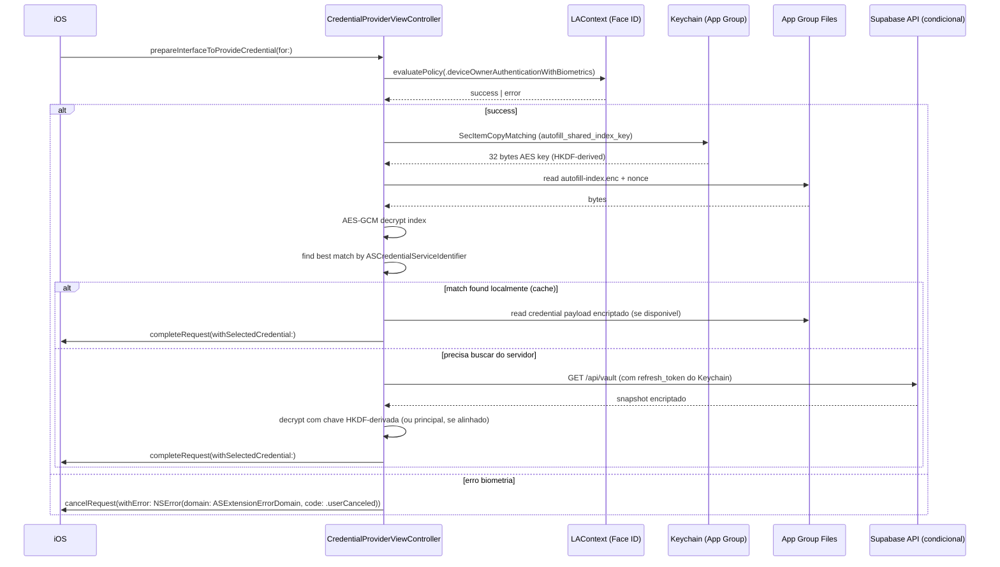

# AutoFill Extension Lifecycle (SafeBox iOS)

Documento de referencia para entender como o iOS invoca o extension e onde o SafeBox **DEVE** intervir em cada momento. Serve para PR review e para treinamento de novos devs.

## 1. Descoberta pelo iOS

1. Usuario instala SafeBox => host app registra AutoFill capability via `Info.plist`
2. Usuario vai em `Settings > Passwords > Password Options` e habilita SafeBox
3. iOS carrega entitlements e valida AASA `webcredentials:safebox.app` do host app
4. Extensao fica elegivel para preencher campos marcados com `textContentType = .password | .username`

**NAO** tem como forcar o usuario a habilitar. UX do SafeBox: mostrar onboarding explicativo apos primeiro login, linkando para `App-prefs:PASSWORDS` via `extensionContext.open`.

## 2. Invocacao

Duas entradas possiveis:

### 2.1 QuickType bar (caminho otimo)

Pre-condicao: host app ja donou `ASPasswordCredentialIdentity` para o dominio visitado.

```
Safari visita example.com
        |
        v
iOS identifica service match com alguma identidade donada
        |
        v
iOS mostra sugestao acima do teclado
        |
        v
Usuario toca sugestao
        |
        v
iOS chama provideCredentialWithoutUserInteraction(for:)
        |
        v
SafeBox responde userInteractionRequired (politica de SEMPRE pedir Face ID)
        |
        v
iOS chama prepareInterfaceToProvideCredential(for:) na UI do extension
```

### 2.2 Selecao manual

Pre-condicao: usuario toca icone de chave no teclado ou `Passwords` -> `SafeBox`.

```
iOS chama prepareCredentialList(for:)
        |
        v
SafeBox mostra UI com lista filtrada por dominio
        |
        v
Usuario seleciona item
        |
        v
SafeBox chama completeRequest(withSelectedCredential:)
```

## 3. Dentro do `prepareInterfaceToProvideCredential`



## 4. Limites de tempo por passo (metas)

| Passo                                  | Alvo (ms)  | Hard ceiling (ms) |
|----------------------------------------|------------|-------------------|
| Face ID prompt -> resposta             | 800        | 3000              |
| Read Keychain                          | 20         | 200               |
| Read + decrypt index (App Group)       | 50         | 500               |
| Match e escolha de credencial          | 10         | 100               |
| Load credential full payload (local)   | 30         | 300               |
| Load credential full payload (remoto)  | 800        | 5000              |
| **Total wall clock**                   | ~1500      | **8000** (nunca ultrapassar) |

Se total passar de 8s consistentemente em device real, revisar pipeline. Limite rigido do sistema e ~25s mas UX ruim muito antes.

## 5. Erros no caminho critico

| Estado                                 | Codigo retornado                                  | UI mostrada                                        |
|----------------------------------------|---------------------------------------------------|----------------------------------------------------|
| Face ID cancelada pelo usuario         | `ASExtensionError.userCanceled`                   | iOS fecha extension automaticamente                |
| Face ID falhou 3x                      | `ASExtensionError.credentialIdentityNotFound`     | Mensagem: "Biometria nao validada. Abra o SafeBox" |
| Index corrompido / chave invalidada    | `ASExtensionError.credentialIdentityNotFound`     | Mensagem: "Abra o SafeBox para sincronizar"        |
| Sem conexao e cache vazio              | `ASExtensionError.failed`                         | Mensagem: "Sem conexao. Abra o SafeBox"            |
| Vault locked por rotacao de senha      | `ASExtensionError.failed`                         | Mensagem: "Faca login no SafeBox novamente"        |

Em todos os casos sensiveis, oferecer deep link para abrir o host app.

## 6. Teste manual obrigatorio (Etapa 6+)

Em device fisico (simulador nao testa extensions bem):

1. **Happy path QuickType**: login web, SafeBox sugerido acima do teclado, Face ID, injecao OK
2. **Happy path picker**: toque manual no icone de chave -> selecao -> Face ID -> OK
3. **Sem habilitar extension**: deve funcionar usar SafeBox sem AutoFill (fallback gracioso)
4. **Trocar Face ID**: reset enrollment no Settings, tentar AutoFill => extension oferece abrir host app
5. **Logout no host**: extension NAO oferece sugestoes; QuickType limpa
6. **Offline**: AutoFill funciona com cache (leitura). Edicao requer host app online (ver skill crypto-parity).
7. **Memoria**: abrir Instruments em device, monitorar extension. Deve ficar abaixo de 30 MB em regime estavel.
8. **Multiplas credenciais**: domain com 2+ credenciais => UI de selecao, Face ID uma vez, injecao da escolhida.

Documentar resultados em `tests/manual/autofill-lifecycle-validation.md` (sera criado na Etapa 6).

## 7. Rejeicoes classicas de AutoFill no App Review

| Violacao observada em reviews publicos                              | Como o SafeBox previne                                                   |
|----------------------------------------------------------------------|--------------------------------------------------------------------------|
| Extensao injeta senha sem biometria                                  | Politica "sempre Face ID" em todo caminho                                |
| Extensao nao encerra processo (memory leak)                          | `completeRequest` ou `cancelRequest` SEMPRE chamados em todo caminho     |
| Descricao no Info.plist nao menciona senhas                          | `NSExtensionAttributes.RequestsOpenAccess` = `YES` documentado, plus `ProvidesPasswords` = true |
| Host app funciona mas extensao nao funciona                          | Matriz de teste cobre os dois                                            |
| Extensao usa APIs que nao existem em extension (`UIApplication`)     | Revisao de PR + lint customizado (ver Etapa 3)                           |
