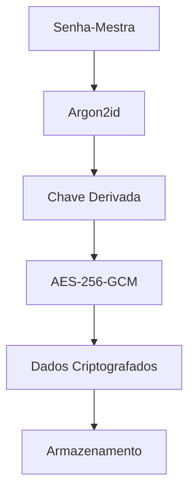

# 🔐 SafeBox - Gerenciador de Senhas com Criptografia Zero-Knowledge

<div align="center">
  
  
  
  
</div>

## 🚀 Visão Geral

SafeBox é um gerenciador de senhas moderno e seguro que implementa criptografia de ponta a ponta com arquitetura zero-knowledge. Suas senhas são criptografadas localmente antes de serem enviadas para o servidor, garantindo que nem mesmo nós podemos acessar seus dados.

## 🛡️ Segurança de Última Geração

### 🔑 Derivação de Chave com Argon2id
- **Algoritmo**: Argon2id (vencedor da Password Hashing Competition)
- **Memória**: 64MB por derivação
- **Iterações**: 3 passes
- **Paralelismo**: 4 threads
- **Proteção contra**: Ataques de força bruta, rainbow tables e ataques de canal lateral

### 🔒 Criptografia AES-256-GCM
- **Tamanho da chave**: 256 bits
- **Modo**: Galois/Counter Mode (GCM)
- **Autenticação**: Integrada com AEAD
- **Nonce**: Único de 96 bits para cada operação
- **Tag**: 128 bits para verificação de integridade

### 🧂 Salt e Nonce Únicos
- **Salt por usuário**: 256 bits gerados aleatoriamente
- **Nonce por operação**: Garante que a mesma senha nunca gera o mesmo texto cifrado
- **Geração segura**: Usando Web Crypto API

### 🔐 Arquitetura Zero-Knowledge
- Senha-mestra nunca é enviada ao servidor
- Derivação de chave acontece no cliente
- Servidor armazena apenas dados criptografados
- Impossível recuperar senhas sem a senha-mestra

## ✨ Funcionalidades

- 📱 **Interface Responsiva** - Funciona perfeitamente em desktop e mobile
- 🔍 **Busca Rápida** - Encontre suas credenciais instantaneamente
- 📁 **Organização por Pastas** - Mantenha tudo organizado
- ⭐ **Favoritos** - Acesso rápido às credenciais mais usadas
- 🔑 **Gerador de Senhas** - Crie senhas fortes e únicas
- 📋 **Copiar com Um Clique** - Copie senhas sem revelá-las
- 🔄 **Sincronização Automática** - Acesse de qualquer dispositivo
- 🌓 **Tema Claro/Escuro** - Confortável em qualquer ambiente

## 🚀 Começando

### Pré-requisitos

- Node.js 16+ 
- NPM ou Yarn
- Conta no [Supabase](https://supabase.com)

### Instalação

1. Clone o repositório
```bash
git clone https://github.com/seu-usuario/safebox.git
cd safebox
```

2. Instale as dependências do frontend
```bash
cd frontend
npm install
```

3. Configure as variáveis de ambiente
```bash
# No diretório frontend, crie o arquivo .env
cd frontend
# Crie o arquivo .env com suas credenciais do Supabase
```

**⚠️ IMPORTANTE**: Configure as seguintes variáveis em `frontend/.env`:
```env
REACT_APP_SUPABASE_URL=https://yourprojectid.supabase.co
REACT_APP_SUPABASE_ANON_KEY=your_anon_key_here
REACT_APP_PUBLIC_APP_URL=https://yourapp.vercel.app
```

📋 **Veja o arquivo `frontend/ENVIRONMENT_SETUP.md` para instruções detalhadas**

4. Execute as migrações de segurança do banco de dados
```sql
-- Execute os scripts em docs/sql/migrations na ordem numérica:
1. 001_grants_minimal.sql
2. 002_rls_core_users.sql
3. 003_rls_audit_backups_sessions.sql
4. 004_two_factor_attempts.sql
5. 005_functions_hardening.sql
6. 006_views_security_invoker.sql
7. 007_grants_followup_hardening.sql
```

5. Execute os pós-checks de segurança
```sql
-- Rodar docs/sql/post-checks.sql e validar:
-- - RLS/FORCE habilitado nas tabelas sensíveis
-- - audit_logs sem INSERT para authenticated
-- - funções sensíveis sem EXECUTE para authenticated
```

6. Inicie o servidor de desenvolvimento
```bash
npm start
```

## 🔧 Configuração

### Variáveis de Ambiente

```env
REACT_APP_SUPABASE_URL=sua_url_do_supabase
REACT_APP_SUPABASE_ANON_KEY=sua_chave_anonima
```

### Configuração do Supabase

1. Crie um novo projeto no Supabase
2. Execute os scripts SQL fornecidos
3. Configure as URLs de redirecionamento em Authentication > URL Configuration:
   - `http://localhost:3000/auth/callback`
   - `https://seu-dominio.com/auth/callback`

## 📱 Uso

### Primeiro Acesso

1. Registre-se com email e senha
2. Confirme seu email
3. Defina sua senha-mestra (esta senha criptografa todos os seus dados)
4. Comece a adicionar suas credenciais

### Segurança da Senha-Mestra

- Use uma senha forte e única
- Nunca compartilhe sua senha-mestra
- Se esquecer, você perderá acesso aos dados (zero-knowledge)
- Recomendamos usar uma frase-senha memorável

## 🏗️ Arquitetura

```
safebox/
├── frontend/               # React + TypeScript
│   ├── src/
│   │   ├── components/    # Componentes reutilizáveis
│   │   ├── pages/        # Páginas da aplicação
│   │   ├── services/     # Serviços e APIs
│   │   ├── contexts/     # Contextos React
│   │   └── types/        # Definições TypeScript
│   └── public/           # Assets estáticos
├── backend/              # Node.js + Express (opcional)
└── database/            # Scripts SQL
```

## 🔒 Fluxo de Segurança



## 🤝 Contribuindo

Contribuições são bem-vindas! Por favor:

1. Fork o projeto
2. Crie sua feature branch (`git checkout -b feature/AmazingFeature`)
3. Commit suas mudanças (`git commit -m 'Add some AmazingFeature'`)
4. Push para a branch (`git push origin feature/AmazingFeature`)
5. Abra um Pull Request

## 📄 Licença

Este projeto está licenciado sob a MIT License - veja o arquivo [LICENSE](LICENSE) para detalhes.

## 🙏 Agradecimentos

- [Argon2](https://github.com/P-H-C/phc-winner-argon2) - Algoritmo de hashing
- [Supabase](https://supabase.com) - Backend as a Service
- [React](https://reactjs.org) - Framework UI
- [Tailwind CSS](https://tailwindcss.com) - Framework CSS

## 📞 Suporte

- 📧 Email: suporte@safebox.com
- 💬 Discord: [SafeBox Community](https://discord.gg/safebox)


Em breve novidades...
- 📖 Documentação: [docs.safebox.com](https://docs.safebox.com)

---

<div align="center">
  Feito com ❤️ e muita ☕ para manter seus dados seguros
</div>
