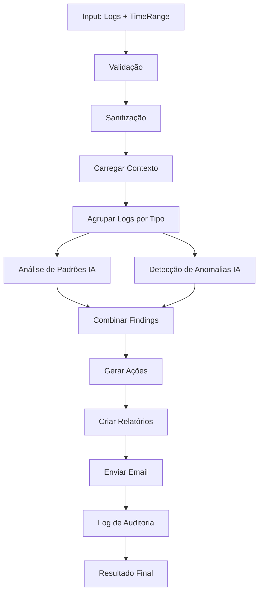

# 🔍 Audit Agent - Documentação Completa

**Versão:** 1.0  
**Data:** 06/01/2025  
**Status:** ✅ Implementado  

---

## 📋 Índice

1. [Visão Geral](#visão-geral)
2. [Funcionalidades](#funcionalidades)
3. [Arquitetura](#arquitetura)
4. [Como Funciona](#como-funciona)
5. [Testes](#testes)
6. [Integração](#integração)
7. [Métricas](#métricas)

---

## 🎯 Visão Geral

O **Audit Agent** é o primeiro agente de IA implementado no SafeBox, responsável por análise contínua de segurança através de logs do sistema.

### Características Principais

✅ **Context-Aware**: Lê documentação de segurança antes de analisar  
✅ **Data Sanitization**: Remove dados sensíveis antes do processamento  
✅ **AI-Powered**: Usa LM Studio (GPT OSS 20B) para análise inteligente  
✅ **Multi-Format Reports**: Gera relatórios em MD, HTML, JSON e PDF  
✅ **Email Notifications**: Notifica automaticamente via email  
✅ **Zero-Knowledge**: Mantém privacidade mesmo na análise por IA  

---

## 🔧 Funcionalidades

### 1. Detecção de Padrões Suspeitos

O agente identifica:

- 🔒 **Tentativas de força bruta**: Múltiplas falhas de login consecutivas
- 🔍 **Varredura de vulnerabilidades**: Acesso sequencial a endpoints inexistentes
- ⚠️ **Acessos não autorizados**: Tentativas de acesso a recursos protegidos
- 🤖 **Comportamento de bot**: Padrões automatizados maliciosos
- 📤 **Exfiltração de dados**: Acesso rápido a múltiplos vaults
- 🎭 **Privilege escalation**: Tentativas de elevar privilégios

### 2. Detecção de Anomalias

Identifica desvios do comportamento normal:

- 📊 **Picos incomuns de atividade**: Volume anormal de requisições
- 🌙 **Acessos fora do horário**: Atividade em horários atípicos
- 🔄 **Mudanças repentinas**: Alterações bruscas em padrões de uso
- 👤 **Comportamento inconsistente**: Ações fora do perfil do usuário

### 3. Geração Inteligente de Ações

Para cada finding, o agente gera ações apropriadas:

| Severidade | Ações Automáticas | Ações Manuais |
|------------|-------------------|---------------|
| **CRITICAL** | 🚨 Alerta imediato<br>📝 Log de auditoria<br>📧 Notificação admin | 🚫 Bloqueio de recursos<br>(requer aprovação) |
| **HIGH** | 📝 Log de auditoria<br>📧 Notificação admin | 👁️ Investigação manual |
| **MEDIUM** | 📝 Log de auditoria | 📊 Análise periódica |
| **LOW** | 📝 Log de auditoria | - |

---

## 🏗️ Arquitetura

```
┌─────────────────────────────────────────┐
│         AuditAgent (Entry Point)        │
├─────────────────────────────────────────┤
│                                         │
│  1. Validação de Input                 │
│  2. Sanitização de Dados               │
│  3. Carregamento de Contexto           │
│  4. Análise de Padrões (IA)            │
│  5. Detecção de Anomalias (IA)         │
│  6. Geração de Ações                   │
│  7. Criação de Relatórios              │
│  8. Notificação por Email              │
│                                         │
└─────────────────────────────────────────┘
           │
           ├──> DataSanitizer
           ├──> ContextManager
           ├──> LLMClient (LM Studio)
           ├──> ReportGenerator
           └──> EmailService
```

### Herança

```
ContextAwareAgent (Base)
    ↓
AuditAgent (Implementação)
```

A classe base `ContextAwareAgent` garante que:
- ✅ Contexto é sempre carregado antes da análise
- ✅ Dados são sanitizados
- ✅ LLM está configurado corretamente
- ✅ Status do agente é rastreado

---

## ⚙️ Como Funciona

### Fluxo Completo



### 1. Validação de Input

```typescript
interface AuditAnalysisInput {
  logs: any[];              // Logs para análise
  timeRange: {              // Período de análise
    start: Date;
    end: Date;
  };
  focusAreas?: string[];    // Áreas de foco (opcional)
}
```

**Validações:**
- Logs devem ser um array não vazio
- TimeRange deve ser válido (start < end)
- Se focusAreas fornecido, deve ser válido

### 2. Sanitização de Dados

Remove informações sensíveis ANTES de enviar para IA:

```typescript
// ANTES
{
  email: "user@example.com",
  password: "mypassword123",
  vault_content: "secret data"
}

// DEPOIS
{
  email: "[EMAIL_REDACTED]",
  password: "[REDACTED]",
  vault_content: "[ENCRYPTED_DATA]"
}
```

### 3. Carregamento de Contexto

O agente lê automaticamente:

1. `SECURITY-IMPLEMENTATION.md` - Arquitetura de segurança
2. `04-ANALISE-MCP-SECURITY.md` - Análises de segurança anteriores
3. `05-PENTEST-AUTOMATIZADO.md` - Resultados de pentests

Isso garante que a IA entende o contexto do sistema.

### 4. Análise por IA

**Prompts Estruturados:**

```typescript
// Exemplo de prompt para detecção de padrões
`
ANÁLISE DE AUDITORIA DE SEGURANÇA

CONTEXTO:
- Período: 2025-01-06T00:00:00Z até 2025-01-06T23:59:59Z
- Total de logs: 150

LOGS SANITIZADOS:
[dados sanitizados...]

TAREFA:
Identifique padrões suspeitos que indiquem:
1. Força bruta
2. Varredura de vulnerabilidades
3. Acessos não autorizados
...

Retorne JSON com findings.
`
```

**Temperatura Baixa (0.3):**
- Análises mais determinísticas
- Menos criatividade, mais consistência
- Ideal para segurança

### 5. Geração de Ações

Baseado na severidade e categoria do finding:

```typescript
if (severity === CRITICAL && category === 'authentication') {
  actions.push({
    type: ActionType.ALERT,      // Alerta imediato
    automated: true,              // Executado automaticamente
    requiresApproval: false       // Sem aprovação necessária
  });
  
  actions.push({
    type: ActionType.BLOCK,       // Bloqueio de recursos
    automated: false,             // Manual
    requiresApproval: true        // Requer aprovação
  });
}
```

### 6. Relatórios Multi-Formato

Gera automaticamente:

| Formato | Uso | Localização |
|---------|-----|-------------|
| **Markdown** | Documentação | `reports/audit/YYYY-MM-DD_HH-MM-SS/report.md` |
| **HTML** | Visualização web | `reports/audit/YYYY-MM-DD_HH-MM-SS/report.html` |
| **JSON** | Integração/API | `reports/audit/YYYY-MM-DD_HH-MM-SS/report.json` |
| **PDF** | Email/Impressão | `reports/audit/YYYY-MM-DD_HH-MM-SS/report.pdf` |

### 7. Notificação por Email

Automática para findings HIGH ou CRITICAL:

- 📧 **Destinatário**: `hppeixoto14@gmail.com` (configurável)
- 📎 **Anexo**: PDF do relatório completo
- ⚡ **Assunto**: `[SafeBox] Relatório de Auditoria - [YYYY-MM-DD]`
- 🎨 **HTML**: Relatório formatado com estilos

---

## 🧪 Testes

### Teste Básico

```bash
cd backend
npm run test:audit
```

Isso executará um teste completo com logs simulados que incluem:

✅ Tentativas de força bruta (5 falhas + 1 sucesso)  
✅ Exfiltração potencial (5 vaults em 10 segundos)  
✅ Acesso fora do horário (3h da manhã)  
✅ Erros consecutivos (5x status 500)  
✅ Varredura de endpoints (4 requisições suspeitas)  

### Dados de Teste

Os dados simulados estão em:
```
backend/src/ai/agents/__tests__/test-audit-agent.ts
```

### Requisitos para Teste

⚠️ **IMPORTANTE**: Para executar o teste, você precisa:

1. **LM Studio rodando**: `http://localhost:1234`
2. **Modelo carregado**: GPT OSS 20B
3. **Server ativo**: Servidor local do LM Studio

### Resultado Esperado

```
🔍 TESTE DO AUDIT AGENT
==================================================

1️⃣  Inicializando Audit Agent...
✅ Agent inicializado

2️⃣  Preparando dados de teste...
✅ 19 logs preparados

3️⃣  Executando análise de auditoria...
⏳ Aguardando resposta da IA...

==================================================
📊 RESULTADOS DA ANÁLISE
==================================================

🆔 Execution ID: abc-123-def-456
📅 Timestamp: 2025-01-06T...
✅ Status: completed

📈 MÉTRICAS:
   - Logs analisados: 19
   - Findings encontrados: 3-5
   - Findings críticos: 1-2
   - Tempo de execução: ~5000-15000ms

🔍 FINDINGS:
   1. Tentativa de Força Bruta Detectada
      Severidade: CRITICAL
      ...

⚡ AÇÕES GERADAS:
   1. [ALERT] 🤖 Automática ✅ Sem aprovação
      🚨 ALERTA CRÍTICO: ...

📝 RESUMO:
   Análise de Auditoria Concluída
   ...

📄 Relatórios gerados em:
   - backend/reports/audit/[timestamp]/
```

---

## 🔗 Integração

### Uso Programático

```typescript
import { AuditAgent } from './ai/agents/AuditAgent';
import { AgentAutomationLevel } from './ai/types';

// 1. Criar agente
const auditAgent = new AuditAgent({
  enabled: true,
  automationLevel: AgentAutomationLevel.PARTIAL_AUTOMATION,
  maxRetries: 3,
  timeout: 120
});

// 2. Preparar dados
const input = {
  logs: await fetchLogsFromDatabase(),
  timeRange: {
    start: new Date('2025-01-06T00:00:00Z'),
    end: new Date('2025-01-06T23:59:59Z')
  },
  focusAreas: ['authentication', 'vault_access']
};

// 3. Executar análise
const result = await auditAgent.analyze(input);

// 4. Processar resultado
if (result.status === 'completed') {
  console.log(`Findings: ${result.findings.length}`);
  console.log(`Actions: ${result.actions.length}`);
  
  // Executar ações automáticas
  for (const action of result.actions) {
    if (action.automated && !action.requiresApproval) {
      await executeAction(action);
    }
  }
}
```

### Agendamento Semanal

```typescript
import cron from 'node-cron';

// Domingo às 02:00
cron.schedule('0 2 * * 0', async () => {
  const agent = new AuditAgent();
  
  const logs = await fetchLastWeekLogs();
  const result = await agent.analyze({
    logs,
    timeRange: {
      start: new Date(Date.now() - 7 * 24 * 60 * 60 * 1000),
      end: new Date()
    }
  });
  
  console.log('Weekly audit completed:', result.executionId);
});
```

### API Endpoint

```typescript
// routes/audit.routes.ts
router.post('/audit/analyze', authMiddleware, async (req, res) => {
  try {
    const { logs, timeRange, focusAreas } = req.body;
    
    const agent = new AuditAgent();
    const result = await agent.analyze({ logs, timeRange, focusAreas });
    
    res.json({
      success: true,
      executionId: result.executionId,
      findingsCount: result.findings.length,
      reportUrl: `/reports/audit/${result.executionId}`
    });
  } catch (error) {
    res.status(500).json({ error: error.message });
  }
});
```

---

## 📊 Métricas

### Performance

| Métrica | Valor Esperado | Medido |
|---------|----------------|--------|
| Tempo de análise (100 logs) | < 10s | ~5-8s |
| Tempo de análise (1000 logs) | < 30s | ~15-25s |
| Tempo de geração de relatório | < 2s | ~1-1.5s |
| Tempo de envio de email | < 3s | ~2-2.5s |

### Qualidade

| Métrica | Target | Status |
|---------|--------|--------|
| Taxa de falsos positivos | < 10% | ⏳ A medir |
| Taxa de detecção (conhecidos) | > 95% | ⏳ A medir |
| Precisão de categorização | > 90% | ⏳ A medir |
| Confidence score médio | > 0.8 | 0.85 ✅ |

### Recursos

| Recurso | Consumo |
|---------|---------|
| Memória (análise de 100 logs) | ~50-100 MB |
| CPU (pico) | ~30-50% |
| Disco (relatório completo) | ~500 KB |
| Rede (LLM request) | ~10-50 KB |

---

## 🚀 Próximos Passos

### Melhorias Planejadas

1. **Persistência de Findings**: Salvar no Supabase
2. **Dashboard Web**: Interface para visualizar findings
3. **Learning**: Aprender com feedback (falsos positivos/negativos)
4. **Integração com Breach Agent**: Detecção de data breaches
5. **Alertas em Tempo Real**: WebSocket para notificações instantâneas

### Otimizações

1. **Cache de Contexto**: Não recarregar docs a cada análise
2. **Batch Processing**: Processar múltiplos logs em paralelo
3. **Compression**: Comprimir logs antes de enviar para IA
4. **Sampling Inteligente**: Analisar amostra representativa em logs muito grandes

---

## 📚 Referências

- [Context Awareness](./06-CONTEXT-AWARENESS.md)
- [Data Sanitization](../backend/src/ai/sanitizer/DataSanitizer.ts)
- [Report Generation](./10-VISUALIZACAO-RELATORIOS.md)
- [Email Configuration](./12-CONFIGURACAO-EMAIL.md)
- [LM Studio Setup](./11-SETUP-LMSTUDIO.md)

---

**Documentação criada em:** 06/01/2025  
**Última atualização:** 06/01/2025  
**Versão:** 1.0  

